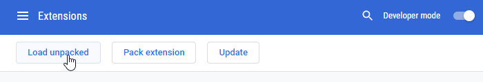

# TheEye Chromium Extension

## Installation

Here is a short guide how to install an unpacked extension on Google Chrome or any Chromium-based browsers (e.g. Opera, Vivaldi). Keep in mind that some browsers might behave differently than vanilla Chromium and Google Chrome

1. Open the "Extensions" page (chrome://extensions/) in the browser and turn on the "Developer mode".
2. Click on the "Load unpacked" button and select the `/src` directory within this repository.

